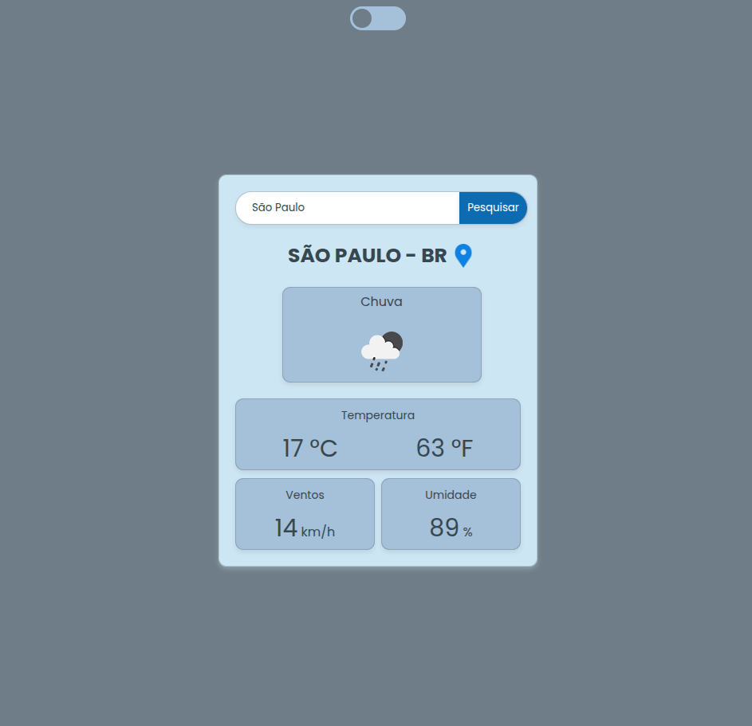
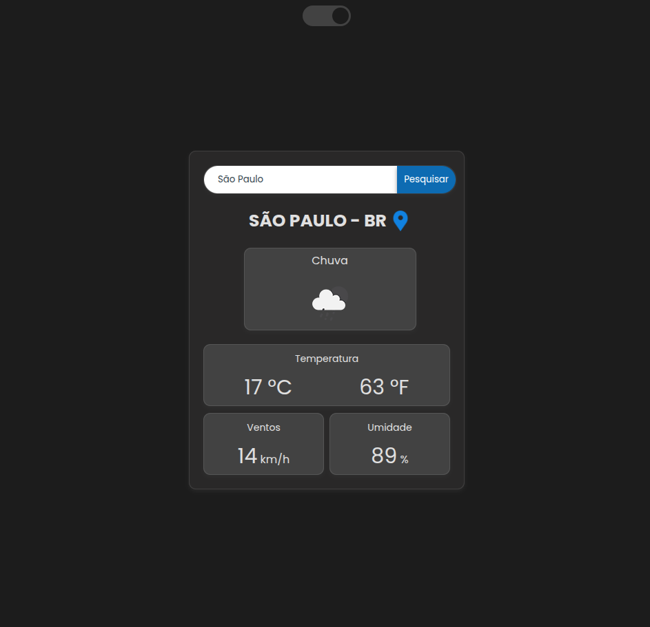

# 🌦️ Previsão do Tempo

Uma aplicação web desenvolvida para consultar a previsão do tempo de qualquer cidade em tempo real. O projeto consome uma API de clima para exibir informações meteorológicas de forma rápida, intuitiva e responsiva.

---

## 🚀 Demonstração

🔗 **Acesse o projeto:**
**https://felipe7f.github.io/previsao-do-tempo/**

---

## 📸 Preview

> Adicione uma imagem do projeto aqui.

```markdown


```

---

## ✨ Funcionalidades

* 🔍 Pesquisa de cidades em tempo real.
* 🌡️ Exibição da temperatura atual.
* ☁️ Condições climáticas.
* 💧 Umidade do ar.
* 🌬️ Velocidade do vento.
* 📱 Layout responsivo para desktop e dispositivos móveis.
* ⚡ Atualização rápida das informações através de uma API.

---

## 🛠️ Tecnologias Utilizadas

<div align="center">


</div>

* **HTML5**
* **CSS3**
* **JavaScript (ES6+)**
* **API de Previsão do Tempo**

---

## 📂 Estrutura do Projeto

```text
previsao-do-tempo/
│
├── index.html
├── style.css
├── script.js
├── assets/
└── README.md
```

---

## ▶️ Como Executar

Clone o repositório:

```bash
git clone https://github.com/felipe7f/previsao-do-tempo.git
```

Entre na pasta do projeto:

```bash
cd previsao-do-tempo
```

Abra o arquivo **index.html** no navegador.

Ou acesse diretamente a versão publicada no GitHub Pages.

---

## 🎯 Objetivo

Este projeto foi desenvolvido com o objetivo de praticar:

* Consumo de APIs REST;
* Manipulação do DOM;
* Requisições assíncronas com `fetch`;
* Tratamento de respostas em JSON;
* Responsividade utilizando CSS;
* Boas práticas de desenvolvimento Front-end.

---

## 🚀 Melhorias Futuras

* ⭐ Favoritar cidades.
* 📍 Localização automática.
* 📅 Previsão para os próximos dias.
* 🌙 Tema claro e escuro.
* 🕒 Histórico de pesquisas.
* 🌎 Suporte para múltiplos idiomas.

---

## 👨‍💻 Autor

Desenvolvido por **Felipe**.

**GitHub:** https://github.com/felipe7f

---

## 📄 Licença

Este projeto está sob a licença **MIT**.

Sinta-se à vontade para estudar, modificar e utilizar este projeto para fins de aprendizado.
